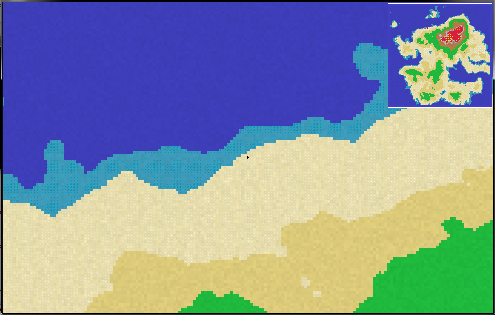
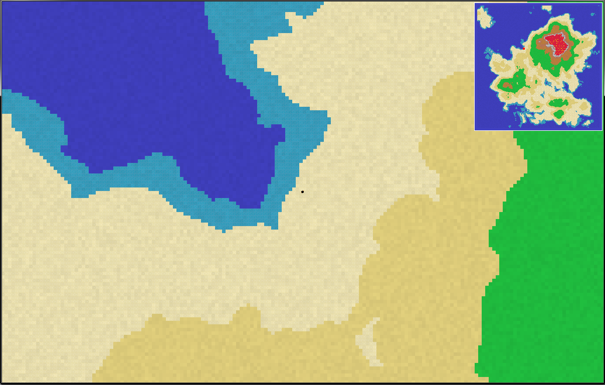
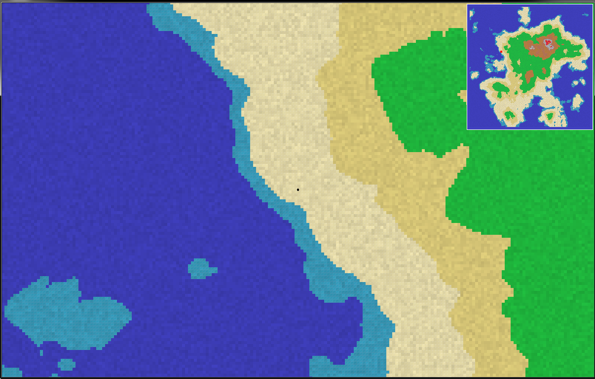
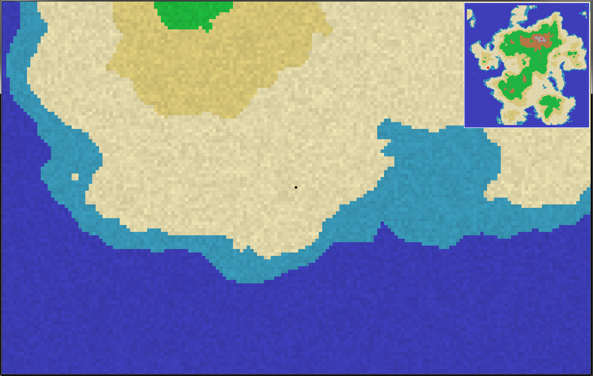
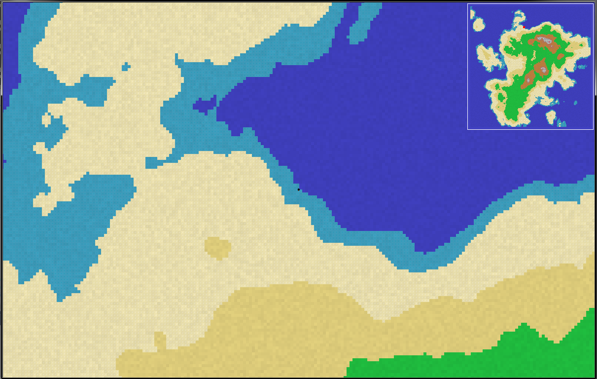

# RL
Roguelike map generator

# About 
Procedurally generates an island-shaped, grid-based map, which the player can move around in.
Uses libnoise for noise functions (Perlin & billow noise), SFML for drawing / window handling / input.

# Controls
- Move mouse to change move direction
- W moves forward
- S moves backward
- A / D strafe left and right
- Shift activates sprint

# Dev Dependencies
- Libnoise
- SFML 2.3.2

# Example Maps

